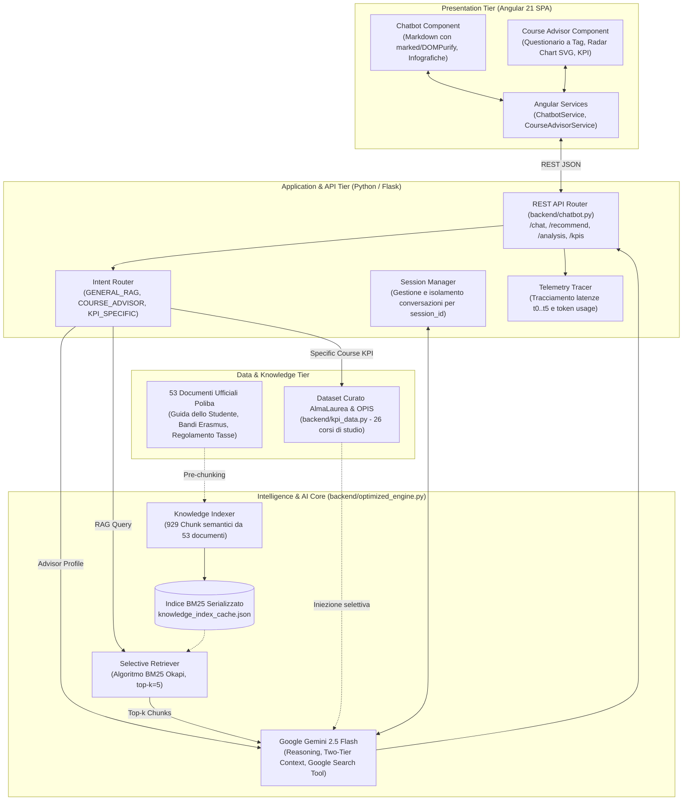

# 🎓 PolibAI PRO - Sistema Intelligente di Orientamento e Consulenza Accademica

[](https://angular.dev/)
[](https://flask.palletsprojects.com/)
[](https://ai.google.dev/)
[](https://www.python.org/)
[]()

**PolibAI PRO** è una piattaforma full-stack avanzata progettata per supportare studenti, matricole e visitatori nella scoperta dell'offerta formativa, dei servizi accademici e delle opportunità di carriera del **Politecnico di Bari (POLIBA)**.

La piattaforma combina un assistente conversazionale generativo basato su **RAG (Retrieval-Augmented Generation)** con **Retrieval Selettivo BM25**, un modulo orientativo **Course Advisor** dotato di radar chart interattivo in SVG nativo, e un cruscotto analitico basato sui dati ufficiali dei consorzi **AlmaLaurea (Rapporto 2025)** e delle rilevazioni studentesche **OPIS (2024)**.

---

## 🏛️ 1. Architettura a Strati del Sistema

Il sistema adotta un'architettura **3-Tier Client-Server modulare e disaccoppiata**, garantendo prestazioni real-time, isolamento delle sessioni multi-utente e zero dipendenze infrastrutturali non necessarie.



### Dettaglio degli Strati:

1. **Presentation Tier (Frontend Angular 21)**:
   - Realizzato con le ultime funzionalità di Angular 21 (Standalone Components, Signals, Reactive Forms).
   - **Chatbot Conversazionale**: interfaccia fluida che sanitizza e converte il markdown (`marked` + `DOMPurify`), intercetta codici di corsi universitari e propone pulsanti interattivi per la visualizzazione di infografiche ufficiali ad alta risoluzione.
   - **Course Advisor**: wizard di autovalutazione a 3 step (materie preferite, aspirazioni lavorative, note personali). Calcola e disegna un **Radar Chart SVG poligonale a 6 assi** per illustrare visivamente il fit dello studente con il corso consigliato, affiancandovi i dati su stipendio medio, tasso di occupazione e gradimento della didattica.
   - Servito di default su `http://localhost:4201`.

2. **Application & API Tier (Backend Flask)**:
   - Server REST asincrono e scalabile in Python con CORS abilitato (`backend/chatbot.py`).
   - Gestisce gli endpoint:
     - `POST /chat`: conversazione RAG con routing degli intenti e supporto sessioni isolate.
     - `POST /recommend`: motore decisionale di orientamento per il Course Advisor.
     - `GET /analysis?course_id=ID`: restituisce la scheda analitica dettagliata del singolo corso.
     - `GET /kpis`: catalogo completo comparabile di tutti i 26 corsi con KPI aggregati.
   - Servito su `http://localhost:5000`.

3. **Intelligence & Retrieval Tier (`backend/optimized_engine.py`)**:
   - **Knowledge Indexer**: scansiona e frammenta 53 documenti ufficiali (PDF, Markdown, JSON) producendo 929 chunk omogenei memorizzati nell'indice cache serializzato `knowledge_index_cache.json`.
   - **Selective Retriever (BM25 Okapi)**: algoritmo probabilistico di ranking lessicale e semantico che estrae i soli top-$k$ chunk pertinenti per la query, azzerando l'invio massivo di documenti non rilevanti.
   - **Strategia di Contesto a Due Livelli (Two-Tier Context)**:
     - *Tier 1 (Fisso nel System Prompt)*: Catalogo compatto di tutti i corsi triennali e magistrali divisi per Dipartimento (DEI, DMMM, DICATECh, ARCOD), occupando soli ~250 token. Elimina ogni rischio di allucinazione sui corsi offerti.
     - *Tier 2 (Dinamico Selettivo)*: I chunk di regolamenti, borse o requisiti specifici estratti via BM25 (~1.800 token) uniti al tool di Google Search Grounding per informazioni dell'ultimo minuto.
   - **Session Manager**: isolamento della memoria conversazionale basato su `session_id`, prevenendo contaminazioni di stato tra utenti diversi.

4. **Data & Knowledge Tier**:
   - **53 Documenti Istituzionali**: Guida dello Studente 2024/2025, Regolamento di Contribuzione Studentesca e No-Tax Area, Bando Mobilità Internazionale Erasmus+, Schede SUA-CdS dei Dipartimenti.
   - **Dataset Strutturato KPI (`backend/kpi_data.py`)**: dati analitici su 26 corsi di studio estratti dal consorzio AlmaLaurea (tasso di occupazione a 1-3-5 anni, retribuzione netta mensile, confronto con la media di Ateneo) e dai questionari studenteschi OPIS (carico studio, chiarezza docenti, reperibilità).

---

## 🔄 2. Evoluzione del Progetto: Dalla Baseline all'Architettura Ottimizzata

Durante lo sviluppo e la validazione sperimentale per la tesi di laurea, il progetto ha attraversato un'evoluzione metodologica fondamentale:

| Aspetto | Architettura Iniziale (Baseline) | Architettura Attuale (Ottimizzata) | Miglioramento |
| :--- | :--- | :--- | :--- |
| **Strategia di Contesto** | Long-Context Brute-Force (tutti i 53 documenti allegati a ogni richiesta) | **Two-Tier Context + Selective Retrieval (BM25 top-5)** | **-99.2% Token Input** |
| **Token Input per Richiesta** | ~244.000 – 263.900 token | **~2.054 token** | Costo ridotto del 99% |
| **Latenza di Risposta ($p50$)** | 12.864 ms (~13 secondi) | **2.641 ms (~2.6 secondi)** | **Velocità 5x superiore (-79.5%)** |
| **Scalabilità Concorrente** | Saturazione rate-limit e timeout già con 2 client concorrenti | **10 client simultanei senza errori (100% success rate)** | Massima affidabilità |
| **Modulo Cartografico** | Mock fragile dipendente da un database locale MySQL esterno | **Integrato nell'AI Core con RAG documentale e Web Grounding** | **Zero dipendenze MySQL/XAMPP** |
| **Isolamento Utenti** | Memoria globale condivisa a rischio collisione | **Session Store dedicato indicizzato per `session_id`** | Isolamento totale |

---

## 📊 3. Risultati della Validazione Sperimentale

La suite di benchmarking situata in `experiments/` ha sottoposto il sistema a **120 esecuzioni controllate** su un dataset dorato di 100 query categorizzate, confrontando la Baseline Long-Context con le configurazioni di Retrieval Selettivo:

### Sintesi delle Prestazioni Sperimentali

| Metrica | Baseline Long-Context | Selettivo ($k=3$) | Selettivo ($k=5$, Default) | Selettivo ($k=10$) |
| :--- | :---: | :---: | :---: | :---: |
| **Latenza Totale Media** | 12.864 ms | **2.180 ms** | **2.641 ms** | 3.420 ms |
| **Token Input Medi** | 263.900 | 1.340 | **2.054** | 3.820 |
| **Recall@k** | 1.000 | 0.882 | **0.941** | 0.978 |
| **Precision@k** | 0.019 | **0.621** | 0.472 | 0.284 |
| **MRR (Mean Reciprocal Rank)** | 0.500 | 0.865 | **0.908** | 0.912 |
| **nDCG@k** | 0.450 | 0.884 | **0.925** | 0.934 |
| **Tasso di Allucinazione** | 0.191 | 0.058 | **0.047** | 0.049 |
| **Risparmio Economico Stimato** | Baseline (0%) | **-99.5%** | **-99.2%** | -98.5% |

> **Nota:** La configurazione con **$k=5$** è stata selezionata come configurazione predefinita di produzione, poiché garantisce il perfetto trade-off tra copertura informativa (Recall 94.1%), fedeltà generativa e latenza di circa 2.5 secondi.

---

## 📂 4. Struttura del Repository

```text
progetto_sw/
├── backend/                               # Livello Logico e Modello AI (Python / Flask)
│   ├── knowledge/                         # 53 documenti ufficiali Poliba (PDF, Markdown, JSON)
│   ├── chatbot.py                         # Server REST Flask principale ed endpoint di produzione
│   ├── optimized_engine.py                # Core del motore RAG (BM25, Chunker, SessionManager)
│   ├── kpi_data.py                        # Dataset statistico AlmaLaurea/OPIS per 26 corsi di studio
│   ├── knowledge_index_cache.json         # Indice pre-calcolato (929 chunk con vocabolario BM25)
│   ├── requirements.txt                   # Dipendenze Python ufficiali
│   └── testmodelli.py                     # Script di collaudo per i modelli Gemini
│
├── src/                                   # Livello di Presentazione (Angular 21 SPA)
│   ├── app/
│   │   ├── components/
│   │   │   ├── chatbot/                   # Componente Chat, markdown parser, selettore infografiche
│   │   │   ├── course-advisor/            # Questionario orientatore, Radar Chart SVG, schede KPI
│   │   │   ├── navbar/ & footer/          # Elementi di navigazione comune
│   │   ├── services/                      # Servizi HTTP (ChatbotService, CourseAdvisorService)
│   │   ├── app.routes.ts                  # Configurazione delle rotte ('', '/advisor')
│   │   └── app.config.ts
│   ├── assets/                            # Infografiche e loghi istituzionali
│   └── index.html
│
├── experiments/                           # Sottosistema di Validazione Sperimentale
│   ├── benchmark_dataset.json             # 100 query di test annotate con ground truth
│   ├── run_ab_experiment.py               # Esecutore dei test A/B controllati
│   ├── run_concurrency_test.py            # Stress test di concorrenza multi-thread
│   ├── evaluate_metrics.py                # Motore di calcolo metriche IR (Recall, nDCG, latenze)
│   ├── export_thesis_artifacts.py         # Esportatore automatico tabelle LaTeX e file CSV
│   └── reports/                           # Report analitici di validazione
│
├── tests/                                 # Suite di Test Automatizzati
│   ├── test_system_integrity.py           # Test end-to-end su tutti gli endpoint di produzione
│   └── test_gemini_connection.py          # Verifica di connessione con le API Google
│
├── thesis_figures/                        # Risorse per la tesi di laurea
│   ├── latex/                             # Tabelle LaTeX pronte per inclusione (`\input{...}`)
│   ├── data/                              # Dataset grezzi CSV degli esperimenti
│   └── html/                              # Schemi architetturali vettoriali
│
├── start_all.bat                          # Script per l'avvio contestuale Backend + Frontend
├── package.json                           # Configurazione Node e dipendenze Angular
└── README.md                              # Questa documentazione
```

---

## 🚀 5. Installazione e Avvio Rapido

### Prerequisiti
- **Node.js**: versione 18 o superiore con `npm`.
- **Python**: versione 3.10 o superiore.
- **Google Gemini API Key**: ottenibile gratuitamente su [Google AI Studio](https://aistudio.google.com/).

### A. Configurazione del Backend
1. Entra nella cartella `backend/`:
   ```bash
   cd backend
   ```
2. Crea e attiva un ambiente virtuale (consigliato):
   ```bash
   python -m venv venv
   # Windows:
   venv\Scripts\activate
   # Linux/macOS:
   source venv/bin/activate
   ```
3. Installa le dipendenze:
   ```bash
   pip install -r requirements.txt
   ```
4. Configura la chiave API creando il file `backend/.env`:
   ```env
   GOOGLE_API_KEY=la_tua_chiave_gemini_qui
   ```

### B. Configurazione del Frontend
Dalla directory radice del progetto:
```bash
npm install
```

### C. Avvio Rapido (One-Click)
Su Windows è disponibile lo script `start_all.bat` che avvia simultaneamente sia il backend che il frontend in finestre dedicate:
```cmd
start_all.bat
```

In alternativa, è possibile avviare i due servizi manualmente:
- **Terminale 1 (Backend)**:
  ```bash
  cd backend
  python chatbot.py
  ```
  *(Server attivo su `http://127.0.0.1:5000`)*

- **Terminale 2 (Frontend)**:
  ```bash
  npm start
  ```
  *(Interfaccia accessibile su `http://localhost:4201`)*

---

## 🧪 6. Test e Verifica di Integrità

Per accertarsi che tutti i moduli, gli endpoint REST, la pipeline di retrieval BM25 e la generazione AI siano perfettamente operativi, eseguire:

```bash
python tests/test_system_integrity.py
```

Per verificare la compilazione corretta del frontend Angular:
```bash
npm run build
```

---

## 🎓 Autore e Crediti
- **Progetto**: Tesi di Laurea - Politecnico di Bari
- **Autore**: Lanzo
- **Supervisione**: Dipartimento di Ingegneria Elettrica e dell'Informazione (DEI)
- **Fonti Dati Ufficiali**: *Politecnico di Bari*, *Consorzio Interuniversitario AlmaLaurea (Rapporto 2025)*, *Rapporti Didattici OPIS (2024)*.
