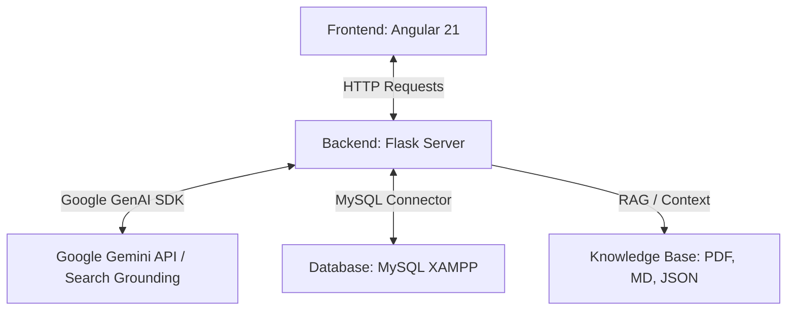

# 🎓 PolibAI - Assistente Navigazione e Orientamento (Angular + Flask)

Benvenuto nella repository ufficiale del progetto **PolibAI**, una piattaforma integrata full-stack progettata per l'orientamento universitario, il recupero interattivo delle metriche occupazionali (Course Advisor) e la navigazione assistita all'interno del campus del Politecnico di Bari (POLIBA). 

Il sistema combina un'interfaccia frontend moderna in **Angular**, un backend **Flask** in Python, l'integrazione con le **Google Gemini API** (sfruttando il grounding della Ricerca Google) e un database relazionale **MySQL** per la gestione della cartografia fisica del campus.

---

## 🏗️ 1. Architettura del Sistema

Il progetto è strutturato secondo un paradigma Client-Server:



1. **Frontend (Angular 21)**: Gestisce l'interfaccia utente reattiva, l'elaborazione dei messaggi Markdown in HTML (tramite `marked` e `dompurify`), il caricamento interattivo delle infografiche e il rendering del grafico radar SVG per le aree di interesse. Servito su `http://127.0.0.1:4201`.
2. **Backend (Python + Flask)**: Coordina l'orchestrazione AI, la gestione dei file di conoscenza per il modello LLM (Gemini Files API), le query spaziali verso il database locale e l'elaborazione dei KPI dei corsi di studio. Servito su `http://127.0.0.1:5000`.
3. **AI Core & RAG (Google Gemini)**: Utilizza l'SDK `google-genai` per interagire con i modelli della famiglia Gemini (`gemini-2.5-flash` o successivi). Include il caricamento dinamico della conoscenza locale e il tool `google_search` per risposte aggiornate in tempo reale.
4. **Database Relazionale (MySQL)**: Memorizza le informazioni stradali e cartografiche del campus per l'instradamento intelligente a seconda dell'ingresso dell'utente.

---

## 📁 2. Struttura delle Cartelle del Progetto

Di seguito viene illustrato l'albero delle directory con le relative responsabilità:

```text
progetto_sw/
├── backend/                       # BACKEND PYTHON (Flask)
│   ├── knowledge/                 # Base di conoscenza locale (Documenti RAG)
│   │   ├── Almalaurea/            # Dati occupazionali e soddisfazione (PDF/MD/JSON)
│   │   ├── Guida allo studente/   # Guida degli studi ufficiale del Politecnico di Bari
│   │   ├── Recensioni Studenti/   # Report e giudizi OPIS degli studenti
│   │   ├── bando_erasmus.pdf      # Regolamento mobilità internazionale
│   │   └── regolamento_contribuzione_studentesca_politecnico_di_bari_25_26.pdf
│   ├── chatbot.py                 # Server Flask principale, endpoint di chat e raccomandazione
│   ├── kpi_data.py                # Database strutturato dei KPI dei corsi (AlmaLaurea & OPIS)
│   ├── polibaDB.py                # Script di inizializzazione e popolamento tabelle MySQL
│   ├── testmodelli.py             # Script helper per testare le chiavi e i modelli Gemini
│   └── .env                       # Variabili d'ambiente (API Key) [Da Creare]
│
├── src/                           # FRONTEND ANGULAR
│   ├── app/
│   │   ├── app.config.ts          # Configurazione di routing e provider di Angular
│   │   ├── app.routes.ts          # Rotte applicative ('' -> Chatbot, '/advisor' -> Course Advisor)
│   │   ├── app.ts / app.html      # Root Component dell'applicazione
│   │   ├── app.css                # Stili globali applicativi
│   │   ├── components/            # Componenti principali dell'interfaccia
│   │   │   ├── chatbot/           # Modulo Chatbot (Interazione AI + Mappe)
│   │   │   └── course-advisor/    # Modulo Orientatore (Form + Grafici + KPI)
│   │   └── data/
│   │       └── infografiche.data.ts # Catalogo e metadati delle infografiche dei corsi
│   └── assets/                    # Asset statici (Immagini, loghi, mappe del campus)
│
├── start_all.bat                  # Script batch per l'avvio rapido di Frontend + Backend su Windows
├── package.json                   # Dipendenze e script di build npm
├── angular.json                   # Configurazione dell'Angular CLI
└── README.md                      # Questa guida
```

---

## 🌟 3. Funzionalità Chiave e Funzionamento Attivo

### A. Chatbot Intelligente Multimodale (RAG + Google Search Grounding)
* **Ingestione Documentale Autonoma**: All'avvio, il server backend esamina la cartella `backend/knowledge/`. Utilizzando la **Gemini File API**, carica i documenti PDF e testuali sul cloud di Google. Lo script esegue prima una chiamata di sincronizzazione (`client.files.list()`) per evitare upload duplicati e velocizzare i tempi di bootstrap.
* **Grounding della Ricerca**: Se un utente pone domande su date, TOLC-I, bandi recenti o eventi non presenti nella conoscenza statica, il chatbot attiva dinamicamente il tool **Google Search** per interrogare il sito ufficiale `poliba.it`, azzerando il rischio di allucinazioni AI.
* **Infografiche Dinamiche**: Durante una conversazione su un determinato corso di laurea (es. Ingegneria Gestionale), il backend rileva l'intento e restituisce un identificatore univoco (`infograficaId`). Il frontend Angular intercetta questo codice e visualizza istantaneamente la relativa infografica grafica associata e i corsi ad essa correlati.

### B. Sistema di Navigazione Fisica del Campus (MySQL)
* Quando l'utente chiede indicazioni (es. *"Dov'è la biblioteca?"* o *"Come arrivo all'ufficio della Prof.ssa Mongiello?"*), il backend avvia un sotto-flusso decisionale:
  1. Identifica la destinazione richiesta.
  2. Risponde proponendo un elenco interattivo di ingressi stradali (es. *Via Orabona, Via Re David, Via Celso Ulpiani*).
  3. All'invio della scelta da parte dell'utente, il server interroga il database locale MySQL (`mappe`), estraendo la descrizione dettagliata del percorso e il file d'immagine topografica corrispondente.
  4. Il frontend renderizza una scheda cartografica con la mappa interattiva.

### C. Course Advisor (Orientatore Accademico)
Una sezione dedicata accessibile alla rotta `/advisor` che implementa un assistente di orientamento avanzato:
* **Survey a Tag**: Lo studente seleziona o digita le materie scolastiche preferite e le proprie aspirazioni professionali future.
* **Logica Decisionale AI**: L'endpoint `/recommend` applica regole specifiche e rigorose fornite nel prompt di sistema (es. distinguere l'offerta formativa tra Laurea Triennale e Laurea Magistrale in base all'avanzamento tecnologico degli argomenti citati).
* **Radar Chart SVG**: Visualizzazione dinamica e animata delle percentuali di affinità dello studente rispetto a 6 macro-aree disciplinari calcolate dal modello.
* **Dashboard KPI Comparativa**: Rende visibili all'utente i dati reali estratti dai report **AlmaLaurea 2025** e **OPIS 2024** per lo specifico corso consigliato:
  * Tasso di occupazione a 1, 3 e 5 anni (comparato visivamente con la media di Ateneo).
  * Retribuzione netta mensile media.
  * Soddisfazione complessiva dei laureati.
  * Valutazioni degli studenti su parametri chiave (es. carico di studio, chiarezza degli esami, utilità della didattica asincrona).

---

## ⚙️ 4. Requisiti e Configurazione dell'Ambiente

### Prerequisiti
* **Node.js** v18 o superiore e `npm`
* **Python** 3.9 o superiore
* **MySQL** (consigliato tramite **XAMPP** o servizi equivalenti)
* Una chiave API valida per **Google Gemini** (ottenibile gratuitamente su [Google AI Studio](https://aistudio.google.com/))

### A. Configurazione del Backend (Python)
1. Spostati nella cartella `backend/`:
   ```bash
   cd backend
   ```
2. Installa le dipendenze Python richieste:
   ```bash
   pip install flask flask-cors python-dotenv google-genai mysql-connector-python
   ```
3. Crea un file nominato `.env` dentro la cartella `backend/` e incolla la tua chiave API di Gemini:
   ```env
   GOOGLE_API_KEY="AIzaSyYourActualGeminiApiKey..."
   ```

### B. Configurazione del Database (MySQL)
1. Avvia XAMPP ed accendi il modulo **MySQL** (e Apache se desideri amministrare tramite phpMyAdmin).
2. Crea un database vuoto chiamato `poliba_chatbot`.
3. Popola ed inizializza la tabella `mappe` eseguendo lo script Python fornito nella cartella backend:
   ```bash
   python polibaDB.py
   ```
   *Questo script creerà automaticamente la struttura tabellare e inserirà i 10 percorsi e le mappe stradali ufficiali del campus.*

### C. Configurazione del Frontend (Angular)
1. Apri una shell nella cartella radice del progetto (`progetto_sw`).
2. Scarica e installa i moduli npm necessari:
   ```bash
   npm install
   ```

---

## 🚀 5. Come Avviare il Progetto

### Avvio Automatico (Consigliato su Windows)
Fai semplicemente doppio click sul file **`start_all.bat`** presente nella directory principale.
Lo script aprirà automaticamente due shell terminali dedicate:
* Una per il server Flask (`python chatbot.py`) sulla porta `5000`.
* Una per il server di sviluppo Angular (`npm start`) sulla porta `4201`.

### Avvio Manuale
Se utilizzi macOS, Linux o preferisci avviare singolarmente i processi:

**Terminale 1: Avvio del Backend**
```bash
cd backend
python chatbot.py
```
*Attendi che la console restituisca `TROVATO E SELEZIONATO: models/gemini-...` e `Running on http://127.0.0.1:5000`.*

**Terminale 2: Avvio del Frontend**
```bash
# Eseguito dalla root directory progetto_sw
npm start
```

---

## 🌐 6. Utilizzo ed Endpoint API

Una volta avviati entrambi i server, apri il tuo browser all'indirizzo:

👉 **[http://127.0.0.1:4201/](http://127.0.0.1:4201/)**

### Elenco Endpoint Backend (Porta 5000)
Il backend Flask espone i seguenti endpoint per l'integrazione con Angular o client terzi:

* **`POST /chat`**: Invia un messaggio testuale all'assistente virtuale.
  * *Request Body*: `{"message": "string"}`
  * *Response*: Restituisce la risposta dell'AI (in formato Markdown), l'eventuale `infograficaId` e i bottoni di scelta rapida (`options`) o dati mappa (`mapUrl`, `mapTitle`) se è stata richiesta la navigazione interna.
* **`POST /recommend`**: Elabora le preferenze dello studente e restituisce un JSON contenente la raccomandazione del corso di studi.
  * *Request Body*: `{"materie": ["string"], "aspirazioni": ["string"], "note": "string"}`
  * *Response*: Restituisce un JSON strutturato con il corso consigliato, motivazione dettagliata con metriche AlmaLaurea, punti di forza, sbocchi e le percentuali relative al grafico radar.
* **`GET /analysis?course_id=ID`**: Recupera le recensioni OPIS e i dettagli AlmaLaurea memorizzati per un dato ID corso (es. `IIA`, `IMEC`, `LMAUTO`).
  * *Response*: Dati strutturati del corso o un errore con la lista degli ID disponibili in caso di ID non trovato.
