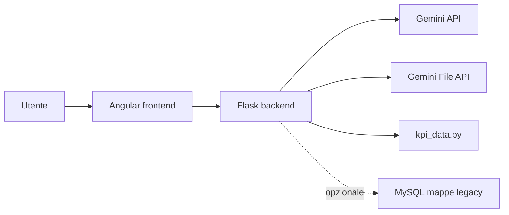

# Poliba Orientamento AI

Demo locale per orientamento universitario al Politecnico di Bari. Il progetto combina un frontend Angular, un backend Flask e Gemini API per rispondere a domande su corsi, servizi, KPI e orientamento.

## Architettura



Il sistema non implementa una RAG classica. La knowledge base viene caricata o riusata tramite Gemini File API e passata al modello come contesto documentale selezionato con un routing euristico leggero. Non sono presenti embedding, retriever custom o vector database.

## Componenti principali

- `src/`: frontend Angular con chatbot e Course Advisor.
- `backend/chatbot.py`: server Flask con endpoint `/chat`, `/recommend` e `/analysis`.
- `backend/kpi_data.py`: dati KPI usati da `/analysis` e dal Course Advisor.
- `backend/knowledge/`: documenti locali usati come knowledge base tramite Gemini File API.
- `backend/polibaDB.py`: script legacy opzionale per popolare le mappe MySQL.
- `start_all.bat`: avvio locale di backend e frontend.

## Backend

Il backend mantiene Flask e usa Gemini API. All'avvio:

1. legge `backend/.env` o variabili ambiente;
2. inizializza Gemini se `GOOGLE_API_KEY` e' presente;
3. riusa i file gia caricati su Gemini File API quando possibile;
4. carica i documenti mancanti da `backend/knowledge/`;
5. seleziona un modello Gemini disponibile, con fallback a `gemini-2.5-flash`.

Per ridurre contesto e latenza, `/chat` e `/recommend` selezionano solo alcuni documenti rilevanti in base a parole chiave su corsi, guida studenti, OPIS e AlmaLaurea.

## Course Advisor

`/recommend` rimane un sistema di raccomandazione basato su Gemini. Il backend arricchisce il prompt con i KPI di `kpi_data.py` e mantiene l'integrazione con `/analysis`.

Il radar chart del frontend usa le percentuali `areeInteresse` generate dal modello AI. Queste percentuali sono stime visuali di affinita, non uno scoring deterministico o ufficiale.

Il parsing JSON della risposta AI accetta anche risposte racchiuse per errore in blocchi markdown e, se il JSON non e' valido, restituisce un errore informativo con anteprima della risposta e schema atteso.

## Mappe legacy

La logica mappe/MySQL e' isolata come modulo opzionale. Se MySQL/XAMPP non e' attivo o la tabella `mappe` non esiste, chatbot e Course Advisor continuano a funzionare.

Lo script `backend/polibaDB.py` popola la tabella `mappe`. La chiave `ufficio_mongiello_Orabona1` e' mantenuta e il backend include alias difensivi per evitare mismatch legacy.

Per disabilitare completamente le mappe:

```powershell
$env:ENABLE_LEGACY_MAPS="0"
```

## Setup locale

Backend:

```powershell
cd backend
python -m venv venv
.\venv\Scripts\activate
pip install -r requirements.txt
```

Creare `backend/.env` senza committarlo:

```env
GOOGLE_API_KEY=la_tua_chiave_gemini
```

Frontend:

```powershell
npm install
npm start
```

Avvio completo:

```powershell
.\start_all.bat
```

Il backend ascolta su `http://127.0.0.1:5000`; il frontend Angular su `http://127.0.0.1:4201`.

## Endpoint

- `POST /chat`: chatbot document-grounded con Gemini File API e modulo mappe opzionale.
- `POST /recommend`: raccomandazione Course Advisor con KPI e parsing JSON robusto.
- `GET /analysis?course_id=IIA`: restituisce i KPI strutturati da `kpi_data.py`.

## Test minimi

I test backend non richiedono chiavi API:

```powershell
python -m unittest discover -s tests
```

Script manuale opzionale per chiamare gli endpoint con server gia avviato:

```powershell
python backend/manual_api_smoke.py
```

## Limitazioni note

- Demo locale, non sistema di produzione.
- Latenza indicativa intorno a 10 secondi, variabile in base a rete, modello e numero di file selezionati.
- Knowledge caricata tramite Gemini File API, non tramite RAG classica con vector database.
- KPI da verificare e mantenere aggiornati rispetto alle fonti ufficiali.
- Radar chart non deterministico: le percentuali sono generate dal modello.
- Mappe legacy opzionali basate su MySQL/XAMPP e asset statici locali.
